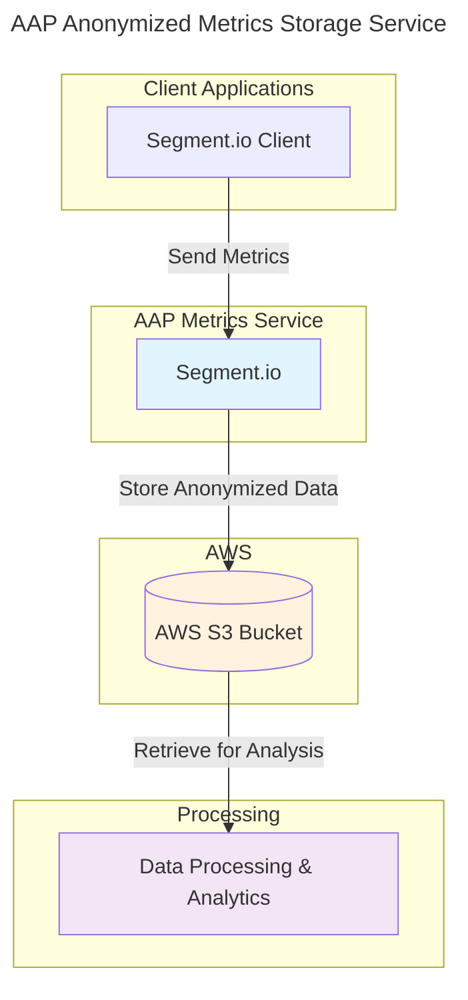

# AAP Metrics Demo

A demo of how to use the AAP Anonymized Metrics Storage Service

## Overview

The AAP (Ansible Automation Platform) Anonymized Metrics Storage Service acts as a bridge between Segment.io clients and AWS S3 storage. This service allows Segment.io clients to collect and store metrics anonymously for later processing and analysis.

## Architecture

The following diagram shows how the components connect and data flows through the system:

## Data Flow

1. **Collection**: Segment.io clients collect metrics from various sources
2. **Transmission**: Metrics are sent to the AAP Anonymized Metrics Storage Service
3. **Anonymization**: The service processes and anonymizes the incoming data
4. **Storage**: Anonymized metrics are stored in an AWS S3 bucket
5. **Processing**: Stored data can be retrieved and processed for analytics and insights

